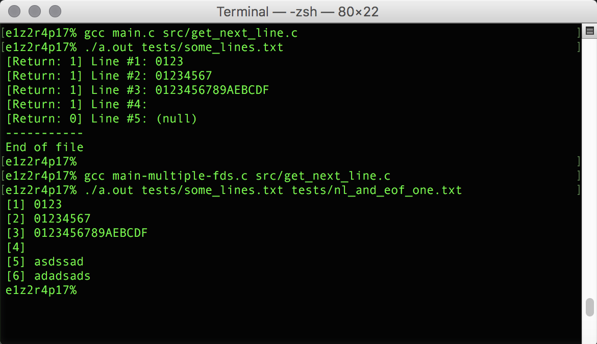

# GNL
Get Next Line is a project at 42.

It is a function that reads a file and allows you to read a line ending with a newline character from a file descriptor. When you call the function again on the same file, it grabs the next line. This project deals with memory allocation and when to free and allocate memory to prevent leaks.

A (-1) is returned if an error occurred. A (0) is returned if the file is finished reading. And a (1) is returned if a line is read.

# Getting Started
## Compiling
Run the following commands:

# To compile
make
# To remove objects:
make clean
# To remove objects and binary file (program):
make fclean
# To re-compile:
make re
# Executing
To test the function, compile with main.c.

gcc main.c src/get_next_line.c

./a.out tests/some_lines.txt

# If wanted to test with multiple file descriptors, compile with main-multiple-fds.c

gcc main-multiple-fds.c src/get_next_line.c

./a.out tests/some_lines.txt tests/nl_and_eof_one.txt

# Screenshots
# Testing the library:
